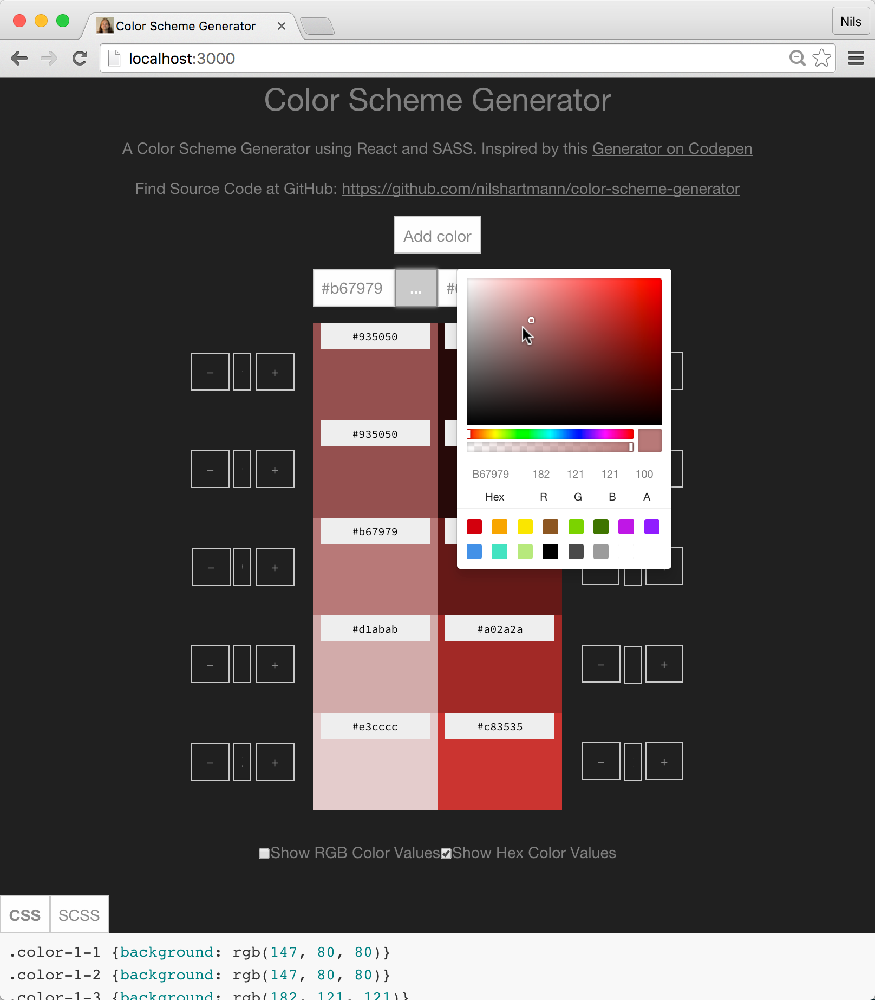

Color Scheme Generator
======================
This is just another Color Scheme Generator, inspired by this codepen from [Andrew](http://codepen.io/TepigMC/): http://codepen.io/TepigMC/pen/YPdLRq.

Use Case
========
You can define up to five *base colors* and generate lighter and darker versions of them. These variantions are calculated by SASS.

Running example
===============
You can find a running example here: `http://nilshartmann.github.io/color-scheme-generator/`

Run
===
* Clone repository
* `npm install`
* `npm start`
* open localhost:3000 in your webbrowser

TODO
====
* clean up code (both CSS and JavaScript)
* Fix CSS (esp for small devices)
* production build should minify js
* sass.js should not be handled by webpack. Include in index.html instead.
* better handling of adding new colors
* save paletts with permalink
* general increasing of shades/hue/...

